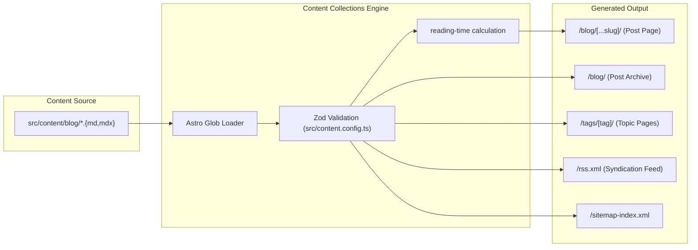

# Authoring & Publishing Guide

A complete reference on how to write, format, preview, and publish new blog posts on **`blog.iammartins.com`**.

---

## Table of Contents

1. [Two Publishing Methods (Web UI vs. Git)](#two-publishing-methods-web-ui-vs-git)
2. [Method 1: In-Browser Publishing via Keystatic (`/keystatic`)](#method-1-in-browser-publishing-via-keystatic-keystatic)
   - [Accessing the Admin UI](#accessing-the-admin-ui)
   - [Local Development Mode](#local-development-mode)
   - [Production Mode (GitHub Sync)](#production-mode-github-sync)
   - [Creating and Editing Posts](#creating-and-editing-posts)
3. [Method 2: Manual Markdown / Git Publishing](#method-2-manual-markdown--git-publishing)
   - [File Location & Slugs](#file-location--slugs)
   - [Markdown (`.md`) vs. MDX (`.mdx`)](#markdown-md-vs-mdx-mdx)
4. [Frontmatter Specification](#frontmatter-specification)
   - [Schema Reference](#schema-reference)
   - [Copy-Paste Starter Template](#copy-paste-starter-template)
5. [How Astro Compiles and Routes Content](#how-astro-compiles-and-routes-content)
6. [Writing Content & Formatting](#writing-content--formatting)
   - [Typography & Structure](#typography--structure)
   - [Code Blocks & Syntax Highlighting (Shiki)](#code-blocks--syntax-highlighting-shiki)
   - [Callouts & Blockquotes](#callouts--blockquotes)
   - [Working with Images & Media](#working-with-images--media)
   - [Embedding Components with MDX](#embedding-components-with-mdx)
7. [Tags & Taxonomy](#tags--taxonomy)
8. [Drafts & Work in Progress](#drafts--work-in-progress)
9. [Local Preview & Quality Checks](#local-preview--quality-checks)
10. [Publishing to Production](#publishing-to-production)
11. [Editorial Voice & Style Guide](#editorial-voice--style-guide)

---

## Two Publishing Methods (Web UI vs. Git)

You can write and publish articles using either of two workflows:

```mermaid
flowchart TD
    subgraph Method 1: Web Interface (Zero Terminal)
        Web["Open /keystatic in Browser"] --> Form["Fill Title, Tags, Description & Write in Rich Editor"]
        Form --> ClickPublish["Click 'Publish'"]
        ClickPublish --> ModeCheck{"Environment"}
        ModeCheck -- "Localhost" --> SaveDisk["Directly writes to src/content/blog/"]
        ModeCheck -- "Production" --> CommitGH["Keystatic commits file to GitHub via API"]
    end

    subgraph Method 2: Code Editor & Git
        LocalFile["Create src/content/blog/slug.md"] --> WriteMD["Write Frontmatter + Markdown"]
        WriteMD --> GitPush["git add . && git push origin main"]
    end

    SaveDisk --> DevPreview["Instant Hot-Reload on http://localhost:4321"]
    CommitGH --> CF["Cloudflare Pages CI/CD Webhook"]
    GitPush --> CF
    CF --> Build["Astro 5 Static Build (`dist/`)"]
    Build --> LiveEdge["Live on blog.iammartins.com"]
```

---

## Method 1: In-Browser Publishing via Keystatic (`/keystatic`)

[Keystatic](https://keystatic.com) is integrated into your blog, providing a visual Notion-like editor without needing a terminal or Git commands.

### Accessing the Admin UI
- **Local Development**: Visit **`http://localhost:4321/keystatic`** with `npm run dev` running.
- **Production**: Visit **`https://blog.iammartins.com/keystatic`** directly from any browser (desktop, tablet, or phone).

### Local Development Mode
When running locally (`npm run dev`), Keystatic runs in **Local Mode**:
1. Open `http://localhost:4321/keystatic`.
2. Click **Blog Posts** $\rightarrow$ **Add Post** (or click any existing post to edit).
3. Type the title (slug is generated automatically), description, publication date, tags, and body.
4. Click **Create** or **Save**.
5. Keystatic immediately writes the `.mdx` file directly into `src/content/blog/` on your computer.
6. Astro hot-reloads and the post is live at `http://localhost:4321/blog/<slug>`.

### Production Mode (GitHub Sync)
When accessed on the live website at `https://blog.iammartins.com/keystatic` or `https://iammartins-blog.pages.dev/keystatic`:

Keystatic authenticates you via GitHub OAuth so it can commit new articles directly to your repository on the `master` branch.

#### Required Cloudflare Pages Environment Variables
When running in production GitHub mode, `@keystatic/core` requires three environment variables in your Cloudflare Pages Dashboard under **Workers & Pages → iammartins-blog → Settings → Environment variables**:

| Variable | Description | Where to Get It |
| :--- | :--- | :--- |
| `KEYSTATIC_GITHUB_CLIENT_ID` | Client ID of your GitHub OAuth App | From your GitHub App settings page |
| `KEYSTATIC_GITHUB_CLIENT_SECRET` | Client Secret of your GitHub OAuth App | Generated in your GitHub App settings |
| `KEYSTATIC_SECRET` | Random 32+ character string for cookie/session encryption | Run `openssl rand -hex 32` in terminal |

> [!WARNING]
> **HTTP 500 Error on Login?**
> If you click "Log in with GitHub" and get an `HTTP ERROR 500`, it means one or more of these environment variables are missing from Cloudflare Pages. Keystatic throws `Missing required config: clientId, clientSecret, secret` when they are undefined.

#### Setting Up Your GitHub App
1. Go to GitHub: **Settings $\rightarrow$ Developer settings $\rightarrow$ GitHub Apps $\rightarrow$ [New GitHub App](https://github.com/settings/apps/new)**.
2. Fill in:
   - **GitHub App name:** `iammartins-blog-cms` (must be globally unique)
   - **Homepage URL:** `https://blog.iammartins.com/keystatic`
   - **Callback URL:** Add both the custom domain and preview domain:
     ```text
     https://blog.iammartins.com/api/keystatic/github/oauth/callback
     https://iammartins-blog.pages.dev/api/keystatic/github/oauth/callback
     ```
   - **Webhook:** Uncheck **Active** (no webhook needed).
   - **Permissions:** Under **Repository permissions**, find **Contents** and set to **Read and write**.
   - Under *Where can this GitHub App be installed?*, select **Only on this account**.
3. Click **Create GitHub App**.
4. In the app settings:
   - Copy the **Client ID**.
   - Under *Client secrets*, click **Generate a new client secret** and copy the secret.
   - Click **Install App** in the left sidebar and install it on `martins-ngene/iammartins-blog`.
5. Add `KEYSTATIC_GITHUB_CLIENT_ID`, `KEYSTATIC_GITHUB_CLIENT_SECRET`, and `KEYSTATIC_SECRET` to your Cloudflare Pages environment variables and trigger a redeployment.

#### Alternative: Zero-Config with Keystatic Cloud
If you prefer not to manage a custom GitHub OAuth App, you can switch to Keystatic Cloud:
1. Sign in at [keystatic.cloud](https://keystatic.cloud) with GitHub (free for personal repos).
2. Add project `martins-ngene/iammartins-blog`.
3. In `keystatic.config.ts`, set `storage: { kind: 'cloud' }` and `cloud: { project: 'martins-ngene/iammartins-blog' }`.
4. No environment variables or custom GitHub Apps required in Cloudflare Pages.

---

## Method 2: Manual Markdown / Git Publishing

### Anatomy of a Blog Post

### File Location & Slugs

Every article lives in the **`src/content/blog/`** directory. 

The filename directly defines the post's **URL slug**:

```text
src/content/blog/
├── csat-insights-pipeline.mdx   -->   https://blog.iammartins.com/blog/csat-insights-pipeline/
├── make-to-n8n-migration.mdx     -->   https://blog.iammartins.com/blog/make-to-n8n-migration/
└── hello-world.mdx              -->   https://blog.iammartins.com/blog/hello-world/
```

#### Slug Naming Rules:
- Use **kebab-case** (all lowercase words separated by single hyphens).
- Keep slugs concise, descriptive, and keyword-relevant (e.g. `redis-queue-bottlenecks.md` instead of `post-2026-03-how-we-solved-our-huge-problem.md`).
- Never use spaces, uppercase characters, or special punctuation in filenames.

### Markdown (`.md`) vs. MDX (`.mdx`)

| Format | When to use |
| :--- | :--- |
| **`.md`** | **Default choice**. Use for pure writing, code blocks, standard markdown tables, and images. Compiles with maximum speed and zero overhead. |
| **`.mdx`** | Use when you need to embed interactive Astro or React components, custom interactive calculators, or custom visual callouts inside the post body. |

---

## Frontmatter Specification

Every post must begin with YAML frontmatter fenced between two lines of triple hyphens (`---`). Astro validates this frontmatter at build time using the Zod schema defined in `src/content.config.ts`.

### Schema Reference

| Field | Type | Required | Description | Example |
| :--- | :--- | :--- | :--- | :--- |
| `title` | `string` | **Yes** | Post title (displayed as H1 and page `<title>`) | `"Refactoring Redis Queues"` |
| `description` | `string` | **Yes** | 1–2 sentence summary used on cards, search results, and social cards | `"How we eliminated consumer lag."` |
| `pubDate` | `date` | **Yes** | Initial publication date (`YYYY-MM-DD`) | `2026-03-15` |
| `updatedDate` | `date` | No | Date when significant revisions were made | `2026-03-20` |
| `tags` | `string[]` | No | Array of lowercase topic tags (defaults to `[]`) | `["performance", "redis"]` |
| `draft` | `boolean` | No | Whether the post is a work-in-progress (defaults to `false`) | `true` |
| `heroImage` | `string` | No | Absolute path to a banner image in `/public` | `"/images/redis-bench.png"` |

### Copy-Paste Starter Template

```markdown
---
title: "Title of Your Post"
description: "A concise 1-2 sentence description explaining the problem solved or insight shared."
pubDate: 2026-03-15
tags: ["engineering", "architecture"]
draft: true
heroImage: "/images/hero-sample.png" # Optional: remove if no hero image
---

Write your opening paragraph here. Hook the reader immediately by stating the context or problem.

## What Happened

Explain the background and the initial system state...
```

---

## How Astro Compiles and Routes Content

Astro automatically routes and compiles blog content during local development and production builds:



### Automatic Features:
1. **Reading Time**: Calculated automatically from the post body words and rendered on the post header (e.g. `// 4 min read`).
2. **Date Formatting**: Displayed consistently in JetBrains Mono using [src/components/FormattedDate.astro](file:///Users/martinium-dev/projects/iammartins-blog/src/components/FormattedDate.astro).
3. **Archive Propagation**: Listed chronologically (newest first) on `/blog` and the homepage.
4. **Tag Pages**: Every tag listed in `tags` gets its own dedicated page at `/tags/<tag>`.
5. **Syndication**: Non-draft posts are automatically added to `https://blog.iammartins.com/rss.xml`.

---

## Writing Content & Formatting

### Typography & Structure

The blog uses an intentional typographic hierarchy:
- **Title (H1)**: Automatically rendered by [src/layouts/BlogPost.astro](file:///Users/martinium-dev/projects/iammartins-blog/src/layouts/BlogPost.astro) using the `title` in frontmatter in **Fraunces**. **Do not add an `# H1` at the start of your post.**
- **Headings (H2, H3)**: Use `##` for main sections and `###` for sub-points.
- **Lede paragraph**: The `description` field from frontmatter is automatically displayed below the title in Fraunces italic style.
- **Body copy**: Rendered in **Inter** with optimal line-height and reading measure ($68\text{ch}$).

### Code Blocks & Syntax Highlighting (Shiki)

Syntax highlighting is powered by **Shiki** at build time. Code renders with zero client-side JavaScript.

Always specify the language tag on fenced code blocks:

````markdown
```ts
interface QueueJob<T> {
  id: string;
  payload: T;
  retries: number;
}

async function processJob(job: QueueJob<Payload>): Promise<void> {
  console.log(`Processing ${job.id}`);
}
```
````

#### Supported Common Languages:
- `ts` / `typescript`
- `js` / `javascript`
- `bash` / `sh`
- `graphql`
- `sql`
- `json`
- `yaml`
- `python`
- `html` / `css`

### Callouts & Blockquotes

Use standard Markdown blockquotes for key takeaways, caveats, or principles:

```markdown
> "Writing forces clarity. If I can't explain why the queue is where it is, I don't understand my own design."
```

For important warnings or technical caveats:

```markdown
> **Caution:** Always run database migrations with an explicit lock timeout when modifying tables in high-throughput production environments.
```

### Working with Images & Media

1. **Storage**: Save images in the `public/images/` directory:
   ```text
   public/
   └── images/
       └── redis-throughput-graph.png
   ```
2. **Referencing in Markdown**:
   ```markdown
   
   ```
3. **Hero Images**:
   If specified in frontmatter (`heroImage: "/images/redis-throughput-graph.png"`), it will be rendered above the article text and used for social media Open Graph cards.
4. **Optimization Tips**:
   - Use PNG or WebP.
   - Recommended width: $1200\text{px}$ to $1600\text{px}$.
   - Compress images with tools like TinyPNG or Squoosh to keep file sizes under $250\text{KB}$.

### Embedding Components with MDX

When you rename a post from `.md` to `.mdx`, you can import and use Astro components directly in the article body:

```mdx
---
title: "Interactive State Machines"
description: "Visualizing transition tables with embedded components."
pubDate: 2026-03-15
tags: ["state-machines", "ui"]
---
import InteractiveDiagram from '../../components/InteractiveDiagram.astro';

Here is the transition table in action:

<InteractiveDiagram state="idle" />

Notice how the transitions handle failure states gracefully.
```

---

## Tags & Taxonomy

Tags group related engineering notes into discoverable topic streams.

- Keep tags **lowercase**, **singular or standard technical term** (e.g. `automation`, `ai`, `graphql`, `engineering`, `career`, `devops`).
- Limit to 2–4 tags per post for focused discovery.
- View existing topics anytime by visiting `/tags`.

---

## Drafts & Work in Progress

Use the `draft` flag to write without making posts public:

```yaml
---
title: "Unfinished Thoughts on Distributed Locks"
description: "Work in progress draft."
pubDate: 2026-03-15
draft: true
---
```

### Draft Visibility Matrix:

| Location | `draft: true` | `draft: false` |
| :--- | :--- | :--- |
| Direct URL (`/blog/my-slug`) | **Visible** (during local development) | **Visible** |
| Post Archive (`/blog`) | Hidden | **Visible** |
| Homepage Latest Posts | Hidden | **Visible** |
| Topic Pages (`/tags/<tag>`) | Hidden | **Visible** |
| RSS Feed (`/rss.xml`) | Excluded | **Included** |
| Cloudflare Production Deploy | Hidden from all indices | **Published** |

---

## Local Preview & Quality Checks

With your development server running (`npm run dev`), test your post locally before committing:

1. **Open the Post**:
   Visit `http://localhost:4321/blog/<your-slug>`
2. **Check the Reading Time**:
   Ensure reading time is calculated accurately in the header.
3. **Check Code Blocks**:
   Verify syntax highlighting renders cleanly in both light and dark backgrounds.
4. **Check Mobile Responsiveness**:
   Resize the browser or inspect in DevTools device mode ($375\text{px}$ width) to confirm code blocks and images do not cause horizontal scrolling.
5. **Run the Build Test**:
   Before pushing, run:
   ```bash
   npm run build
   ```
   If there is a typo in frontmatter (e.g. invalid date format or missing description), Zod will report the exact line and error.

---

## Publishing to Production

Once your article is ready:

### 1. Set Draft to False
```yaml
draft: false
```
Verify that `pubDate` reflects your intended publication date.

### 2. Commit and Push
```bash
git add src/content/blog/my-new-post.md
git commit -m "feat(blog): publish post on my-new-post"
git push origin main
```

### 3. Automatic Deployment
Cloudflare Pages automatically detects the commit on `main`, runs `npm run build`, and ships the static files to Cloudflare's global edge network in ~30–45 seconds.

### 4. Post-Publish Verification
- Visit `https://blog.iammartins.com/blog/my-new-post/`.
- Verify the post appears at `https://blog.iammartins.com/blog/`.
- Check `https://blog.iammartins.com/rss.xml` to verify the feed has picked up the new entry.

---

## Editorial Voice & Style Guide

This blog is a **working engineering notebook in public**. Keep these core principles in mind when drafting:

1. **Leave the trade-offs in**:
   Avoid sanitizing architecture stories. Discuss what broke, why an initial approach failed, and the constraints that dictated the chosen solution.
2. **Explain the "why", not just the "what"**:
   Code snippets are helpful, but the architectural rationale behind queues, batching, caching, or data modeling is where true insight lives.
3. **Keep the prose crisp**:
   Lead with the problem statement in the first two sentences. Use short paragraphs and clear section headings.
4. **Embrace detours**:
   Reflections connecting linguistics (Hebrew/Greek), systems thinking, or philosophy are welcome when clearly labelled.
